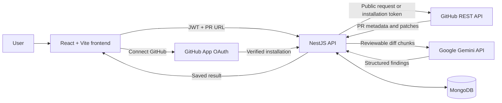
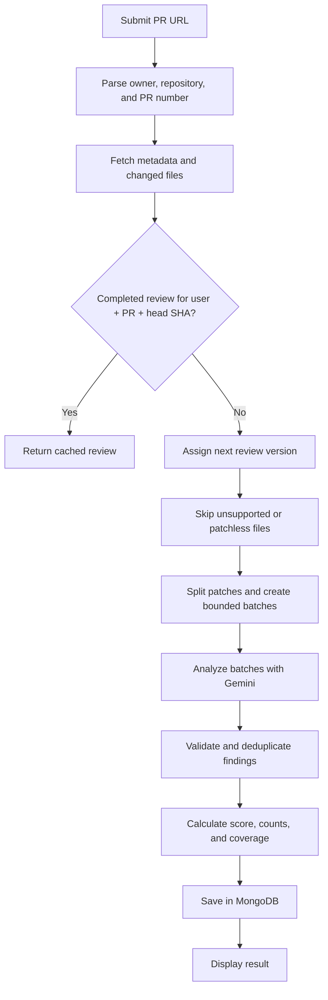

# PR Insight

AI-assisted GitHub pull request review for public and authorized private repositories.

PR Insight is a full-stack developer tool that accepts a GitHub pull request URL, retrieves its metadata and changed-file patches, and produces a structured review with Google Gemini. It highlights potential bugs, security concerns, performance problems, code-quality issues, maintainability concerns, and best-practice issues.

Findings and scores are decision-support signals—not guarantees that code is correct or that every reported issue is a real defect. Results should be verified by a human reviewer.

## Key features

- Public PR analysis without a GitHub connection and private PR analysis through a GitHub App
- Email/password authentication with JWT-protected application routes
- User-scoped MongoDB review history and GitHub installation associations
- PR metadata, changed-file statistics, and diff retrieval
- Structured findings with category, severity, description, and suggested remediation
- Critical, high, medium, low, and info severity levels
- Deterministic score, severity counts, summary, and analysis coverage
- SHA-based cached review reuse and duplicate prevention
- Review versioning when the PR head commit changes
- Comparison of saved versions, including new, resolved, and unchanged findings
- Pagination for large changed-file responses
- Filtering of lockfiles, generated/build output, binary assets, minified files, and missing patches
- Patch splitting, bounded multi-request Gemini analysis, deduplication, and partial-result handling
- Short-lived GitHub installation access tokens created only on the backend
- Jest backend tests and Vitest/Testing Library frontend tests

## Screenshots

### Analyze Pull Request


### Review Result


### Review History


### About


## Architecture



The frontend never receives the GitHub App private key, OAuth user token, or installation access token.

## Review pipeline



GitHub requests retry selected temporary network failures. Gemini requests retry rate-limit and service-unavailable responses and can fall back through the configured model list. If some batches succeed and others fail, successful findings are retained and the result is marked partial. A review is not saved when every batch fails.

## Review score

The backend starts at 100, subtracts a penalty for every recognized finding, and clamps the result to 0–100.

| Severity | Penalty |
| --- | ---: |
| Critical | 25 |
| High | 15 |
| Medium | 8 |
| Low | 3 |
| Info | 1 |

The UI uses these implemented score labels:

| Score | Label |
| --- | --- |
| 90–100 | Excellent |
| 75–89 | Good |
| 60–74 | Needs Attention |
| 0–59 | High Risk |

## Versioning and cache behavior

Each review records the PR head commit SHA. A completed review belonging to the same PR Insight user, repository, PR number, and head SHA is reused instead of running Gemini again. A new SHA creates the next numbered version while previous versions remain available. Users can compare versions for score and severity changes and new, resolved, or unchanged findings.

A compound MongoDB unique index prevents duplicate reviews for the same user and head SHA, including concurrent requests.

## Large pull request handling

- Changed files are fetched in pages of 100, up to GitHub's 3,000-file endpoint limit.
- Lockfiles, binary/media/font/archive assets, snapshots, minified CSS/JavaScript, and files in `build`, `coverage`, `dist`, `generated`, or `vendor` directories are skipped.
- Files without a GitHub patch are excluded from AI analysis.
- Patches default to a maximum of 30,000 characters before splitting.
- Prepared files default to batches of at most 60,000 characters.
- Findings are deduplicated by normalized file, category, and title.
- Coverage records total, reviewed, and skipped files, processed/failed batches, and partial status.

Patch and batch limits are configurable through backend environment variables.

## Private repository support

```mermaid
flowchart LR
    A[Authenticated user] --> B[Connect GitHub]
    B --> C[Authorize GitHub App]
    C --> D[Choose repositories]
    D --> E[Verify installation belongs to GitHub user]
    E --> F[Associate installation with PR Insight user]
    F --> G[Create short-lived installation token]
    G --> H[Fetch authorized private PR]
    H --> I[Run standard review pipeline]
```



The association stores the PR Insight user ID, installation ID, GitHub account login/type, and timestamps—not OAuth or installation tokens. For a private PR, the backend finds the current user's installation, creates a temporary repository-scoped token, verifies access, and uses the same pipeline as a public PR.

The GitHub App requests read-only **Contents** and **Pull requests** access. Users should select only repositories they want PR Insight to analyze.

## Technology stack

| Area | Technology |
| --- | --- |
| Frontend | React 19, TypeScript, Vite |
| Backend | NestJS 11, TypeScript, Axios/RxJS |
| Database | MongoDB, Mongoose |
| AI | Google Gemini through `@google/genai` |
| GitHub integration | GitHub REST API, GitHub App OAuth, `@octokit/auth-app` |
| Authentication | Email/password, bcryptjs, JWT |
| Testing | Jest, Supertest scaffold, Vitest, Testing Library, jsdom |
| Version control | Git and GitHub |

Playwright is not installed or configured, so browser end-to-end tests are not claimed.

## Project structure

```text
pr-insight/
├── backend/
│   ├── src/
│   │   ├── ai/          # Gemini preparation, batching, and validation
│   │   ├── auth/        # Registration, login, and JWT guard
│   │   ├── github/      # PR parsing and GitHub REST requests
│   │   ├── github-app/  # OAuth, installations, and private access
│   │   ├── reviews/     # Persistence, scoring, versions, comparison
│   │   └── users/       # User schema and lookup service
│   ├── secrets/         # Local GitHub App keys; ignored by Git
│   ├── test/            # Jest/Supertest e2e scaffold
│   └── .env.example
├── frontend/
│   ├── public/          # Static icons and favicon
│   └── src/
│       ├── auth/        # Authentication context
│       ├── components/  # Analysis, history, comparison, connection UI
│       ├── services/    # API client and endpoint wrappers
│       ├── test/        # Vitest setup and factories
│       └── types/       # Frontend domain types
└── README.md
```

## Local setup

### Prerequisites

- Node.js 20 or newer
- npm
- MongoDB (local or Atlas)
- Google Gemini API key
- GitHub account
- GitHub App credentials and private key for private PRs

### 1. Clone and install

```bash
git clone <repository-url>
cd pr-insight/backend
npm install

cd ../frontend
npm install
```

### 2. Configure the backend

Copy `backend/.env.example` to `backend/.env`, then replace placeholders in the ignored `.env` only:

```powershell
Copy-Item backend/.env.example backend/.env
```

```env
MongoDB_URI=mongodb_connection_string
GEMINI_API_KEY=your_gemini_api_key
JWT_SECRET=replace_with_a_long_random_secret
JWT_EXPIRES_IN=1d
PORT=3000

MAX_PATCH_CHARS=30000
AI_REVIEW_CHUNK_MAX_CHARS=60000

GITHUB_APP_ID=your_github_app_id
GITHUB_APP_SLUG=your_github_app_slug
GITHUB_APP_CLIENT_ID=your_github_app_client_id
GITHUB_APP_CLIENT_SECRET=your_github_app_client_secret
GITHUB_APP_PRIVATE_KEY_PATH=./secrets/github-app-private-key.pem
FRONTEND_URL=http://localhost:5173
```

GitHub variables are required only for private-repository connections. `JWT_EXPIRES_IN`, `PORT`, patch limits, and `FRONTEND_URL` have application defaults.

The frontend defaults to `http://localhost:3000`. For a different API address, create `frontend/.env.local`:

```env
VITE_API_URL=http://localhost:3000
```

### 3. Run locally

Backend terminal:

```bash
cd backend
npm run start:dev
```

Frontend terminal:

```bash
cd frontend
npm run dev
```

Open `http://localhost:5173` unless Vite reports another port.

### Vercel production environment

Set these variables in the respective Vercel projects for the Production environment:

| Project | Variable | Value |
| --- | --- | --- |
| Frontend | `VITE_API_URL` | `https://<stable-backend-production-domain>` |
| Backend | `FRONTEND_URL` | `https://<stable-frontend-production-domain>` |

Use each project's stable production domain or assigned custom domain, without a path, rather than a deployment-specific preview URL. `FRONTEND_URL` must match the origin where you open the frontend. Redeploy both projects after setting the variables; Vite embeds `VITE_API_URL` at build time.

The backend allows the configured frontend origin alongside the existing localhost and `127.0.0.1` origins. The frontend API defaults to `http://localhost:3000` when `VITE_API_URL` is unset or blank. GitHub App return redirects use `FRONTEND_URL`, defaulting to `http://localhost:5173`.

For production GitHub App authorization, configure the app's Callback URL / Redirect URI as `https://<stable-backend-production-domain>/github-app/setup`. The current flow uses the callback configured in GitHub App settings; it does not construct a backend callback URL in application code. Keep the local callback configuration available for local development (for example, using a separate development GitHub App).

## GitHub App setup

| Setting | Local value |
| --- | --- |
| Callback URL / Redirect URI | `http://localhost:3000/github-app/setup` |
| User authorization during installation | Enabled |
| Contents permission | Read-only |
| Pull requests permission | Read-only |
| Webhooks | Disabled |

When authorization during installation is enabled, GitHub uses the callback URL instead of a separate post-installation Setup URL. The backend route is named `/github-app/setup`, but handles the verified OAuth callback.

Place the downloaded private key at `GITHUB_APP_PRIVATE_KEY_PATH`. Keep it server-side and never commit `.env`, `.pem` files, or `backend/secrets/`.

## API overview

| Method | Endpoint | Purpose | Authentication |
| --- | --- | --- | --- |
| `GET` | `/` | Basic API response | No |
| `POST` | `/auth/register` | Create account and return JWT | No |
| `POST` | `/auth/login` | Authenticate and return JWT | No |
| `GET` | `/auth/me` | Restore current user | JWT |
| `POST` | `/reviews` | Analyze and persist a PR review | JWT |
| `GET` | `/reviews` | List current user's reviews | JWT |
| `GET` | `/reviews/:id` | Retrieve an owned review | JWT |
| `GET` | `/reviews/:id/compare/:otherId` | Compare two owned PR versions | JWT |
| `GET` | `/github-app/connect` | Start GitHub authorization | JWT |
| `GET` | `/github-app/setup` | Verify callback/installations and redirect | OAuth code + one-time state |
| `GET` | `/github-app/status` | Get current user's connection status | JWT |
| `DELETE` | `/github-app/disconnect` | Remove user's installation associations | JWT |
| `POST` | `/github/pr` | Fetch public PR data directly | No |
| `POST` | `/ai/review` | Run legacy public-PR review endpoint | No |

Protected requests use `Authorization: Bearer <token>`.

## Testing

```bash
cd backend
npm test
npm run build

cd ../frontend
npm test
npm run build
```

The backend also has a Supertest e2e scaffold:

```bash
cd backend
npm run test:e2e
```

It loads the application module and requires an isolated test environment and database. Do not point automated tests at production data.

## Security considerations

- Review and history routes are scoped to the authenticated JWT user.
- Passwords are hashed with bcryptjs.
- GitHub installations are associated per user and protected by a compound unique index.
- Connection state is random, short-lived, stored as a hash, and consumed once.
- Installations are checked against the authorizing GitHub user and verified as the configured app.
- Repository permissions are read-only.
- Installation tokens remain temporary and server-side.
- Secrets come from backend environment variables; `.env`, `*.pem`, and `backend/secrets/` are ignored.
- The MVP stores its JWT in browser `localStorage`; an HttpOnly secure-cookie design would be preferable for production.

## Limitations

- AI findings can contain false positives or miss actual defects.
- Analysis uses PR patches rather than complete repository and runtime context.
- GitHub may omit patches for binary files or very large diffs; patchless files are skipped.
- Generated, binary, lock, build, and configured low-value files are intentionally excluded.
- GitHub caps changed-file retrieval at 3,000 files; API/model availability and limits can affect large reviews.
- Frontend progress stages are estimates rather than server-streamed progress.
- Playwright tests and deployment configuration are not included.

## Future improvements

- Webhook-triggered reviews when pull requests change
- Inline GitHub review comments or checks
- Team dashboards and shared review policies
- Additional AI providers
- Richer repository context beyond the submitted diff

## License

The backend package is currently marked `UNLICENSED`. Add an explicit repository license before distribution or external contribution.
